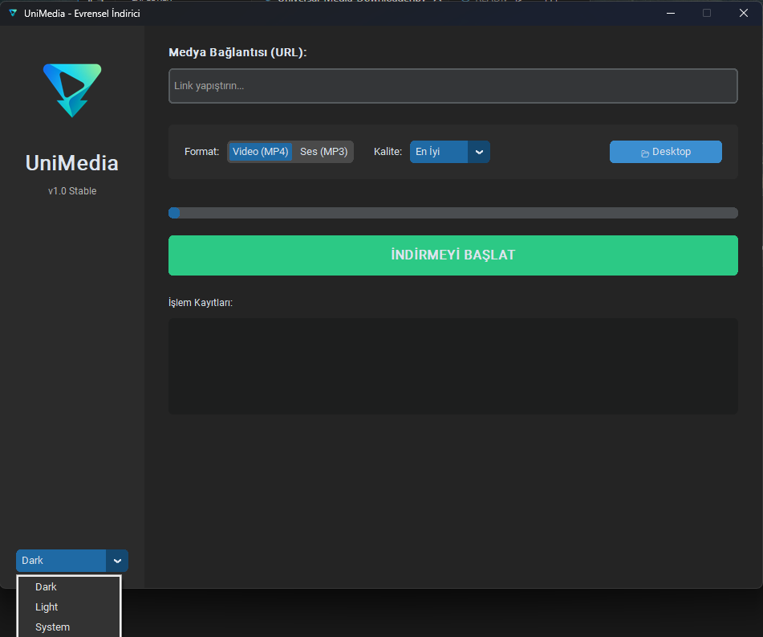

# ⚡ UniMedia - Universal Media Downloader


UniMedia, modern arayüzü ve güçlü altyapısı ile internet üzerindeki video ve ses dosyalarını indirmeyi sağlayan profesyonel bir masaüstü uygulamasıdır.

# 🚀 Özellikler

Evrensel Destek: YouTube, Instagram, TikTok, Twitter (X) ve daha fazlası.

Format Seçenekleri:

*🎬 Video (MP4): En iyi görüntü ve sesi otomatik birleştirir.

*🎵 Ses (MP3): Videodan sesi ayıklar ve yüksek kalitede (192kbps) dönüştürür.

Akıllı İsimlendirme: Dosya çakışmalarını önler (Örn: 2_Video_1080p.mp4).

Modern Arayüz: CustomTkinter ile karanlık/aydınlık mod destekli şık tasarım.

Taskbar Entegrasyonu: Windows görev çubuğunda özel logo ile çalışır.



# 🛠️ Kurulum (Geliştiriciler İçin)

Projeyi bilgisayarınızda çalıştırmak veya geliştirmek için:

Repoyu Klonlayın:
``` bash
# Windows (PowerShell)
git clone [https://github.com/Omer-Murat/Universal-Media-Downloader.git](https://github.com/Omer-Murat/Universal-Media-Downloader.git)
cd REPO_ADIN
```

Gerekli Kütüphaneleri Kurun:
``` bash
# Windows (PowerShell)
pip install -r requirements.txt
```

FFmpeg Kurulumu (Önemli!):
Uygulamanın video birleştirme ve ses dönüştürme yapabilmesi için ffmpeg.exe dosyasına ihtiyacı vardır.

ffmpeg.exe dosyasını indirin ve projenin ana klasörüne (Universal-Media-Downloader.py yanına) atın.

▶️ Kullanım

Uygulamayı başlatın:
```bash
# Windows (PowerShell)
python Universal-Media-Downloader.py
```

Medyanın linkini yapıştırın.

Format (Video/Ses) ve Kalite seçin.

"İndirmeyi Başlat" butonuna tıklayın.

# 📦 EXE Oluşturma

Projeyi tek bir .exe dosyasına dönüştürmek için:
``` bash
# Windows (PowerShell)
pyinstaller --noconsole --onefile --icon=logo.ico --add-data "logo.png;." --add-data "logo.ico;." Universal-Media-Downloader.py
```

Not: Bu proje eğitim amaçlıdır. Telif haklarına saygı gösteriniz.

Geliştirici: Ömer Murat
